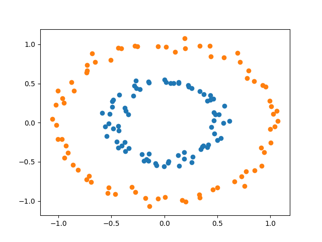
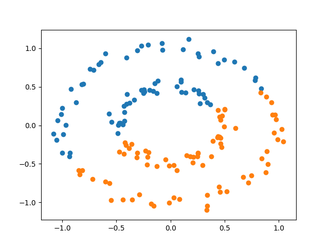
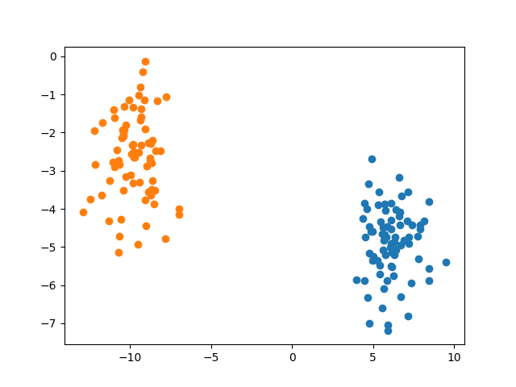

# CH14 聚类方法

[TOC]

## 前言

### 章节目录

1. 聚类的基本概念
   1. 相似度或距离
   1. 类或簇
   1. 类与类之间的距离
1. 层次聚类
1. k均值聚类
   1. 模型
   1. 策略
   1. 算法
   1. 算法特性

### 导读

- Kmeans是1967年由MacQueen提出的，注意KNN也是1967年提出的，作者是Cover和Hart。

## 聚类的基本概念

以下实际上是算法实现过程中的一些属性。

矩阵$X$表示样本集合，$X\in \mathbf{R}^m,x_i,x_j\in X, x_i=(x_{1i},x_{2i},\dots,x_{mi})^{\mathrm T},x_j=(x_{1j},x_{2j},\dots,x_{mj})^\mathrm T$，$n$个样本，每个样本是包含$m$个属性的特征向量，

### 距离或者相似度

#### 闵可夫斯基距离

$$
d_{ij}=\left(\sum_{k=1}^m|x_{ki}-x_{kj}|^p\right)^\frac{1}{p}\\
p \ge 1
$$

这个图可以再展开

#### 马哈拉诺比斯距离

马氏距离

$d_{ij}=\left[(x_i-x_j)^\mathrm TS^{-1}(x_i-x_j)\right]^{\frac{1}{2}}$

#### 相关系数

$$
r_{ij}=\frac{\sum\limits_{k=1}^m(x_{ki}-\bar x_i)(x_{kj}-\bar x_j)}{\left[\sum\limits_{k=1}^m(x_{ki}-\bar x_i)^2\sum\limits_{k=1}^m(x_{kj}-\bar x_j)^2\right]^\frac{1}{2}}\\
\bar x_i=\frac{1}{m}\sum\limits_{k=1}^mx_{ki}\\
\bar x_j=\frac{1}{m}\sum\limits_{k=1}^mx_{kj}
$$

#### 夹角余弦

$$
s_{ij}=\frac{\sum\limits_{k=1}^m x_{ki}x_{kj}}{\left[\sum\limits_{k=1}^mx_{ki}^2\sum\limits_{k=1}^mx_{kj}^2\right]^\frac{1}{2}}
$$

#### 距离和相关系数的关系

其实书上的这个图，并看不出来距离和相关系数的关系，但是书中标注了角度的符号。

### 类或簇

### 类与类之间的距离

类和类之间的距离叫做linkage，这些实际上是算法实现过程中的一些属性。

类的特征包括：均值，直径，样本散布矩阵，样本协方差矩阵

类与类之间的距离：最短距离，最长距离，中心距离，平均距离。

类$G_p$和类$G_q$

#### 最短(single linkage)

$D_{pq}=\min\{d_{ij}|x_i\in G_p, x_j \in G_q\}$

#### 最长(complete linkage)

$D_{pq}=\max \{d_{ij}|x_i \in G_p, x_j \in G_q\}$

#### 平均(average linkage)

$D_{pq}=\frac{1}{n_pn_q}\sum\limits_{x_i\in G_p}\sum\limits_{x_j\in G_q}d_{ij}$

#### 中心

$D_{pq}=d_{\bar x_p\bar x_q}$

## 层次聚类

层次聚类**假设**类别之间存在层次结构。

层次聚类可以分成聚合聚类和分裂聚类。

聚合聚类三要素：

1. 距离或相似度：闵可夫斯基，马哈拉诺比斯，相关系数，余弦距离
1. 合并规则：类间距离最小，最短，最长，中心，平均
1. 停止条件：类的个数达到阈值，类的直径达到阈值

### 算法14.1

输入：$n$个样本组成的集合$X$

输出：对样本的一个层次化聚类$C$

1. 计算$n$个样本两两之间的欧氏距离$\{d_{ij}\}$，记作矩阵$D=[d_{ij}]_{n\times n}$
1. 构造$n$个类，每个类只包含一个样本
1. 合并类间距离最小的两个类，其中最短距离为类间距离，构建一个新类。
1. 计算新类与当前各类之间的距离。如果类的个数是1， 终止计算，否则回到步骤3。

这个算法复杂度比较高$O(n^3m)$

如图，采用层次聚类实现circle的划分。

## Kmeans聚类

注意对于kmeans来说，距离采用的是欧氏距离**平方**，这个是个特点。

### 算法14.2

输入：$n$个样本的集合$X$

输出：样本集合的聚类$C^*$

1. 初始化。
1. 对样本进行聚类。
1. 计算类的中心。
1. 如果迭代收敛或符合停止条件，输出$C^*=C^{(t)}$

对于Cirlce数据，如果采用kmeans聚类，得到结果如下

Blob数据采用kmeans结果如下

## 例子

### 14.1

这个例子里面，直接给定的是距离矩阵，类间距离选择的是最小距离。

### 14.2

这个例子很有意思，实际上，最好的划分，不一定是书中给的答案的划分。这也说明了初值的选择，对于kmeans算法最后的结果影响比较重要。

在后面的初始类选择部分，对此做了解释。但是实际上在做到这个例子的时候应该就能想到这个问题，书中选择的数据很典型。

## 参考

