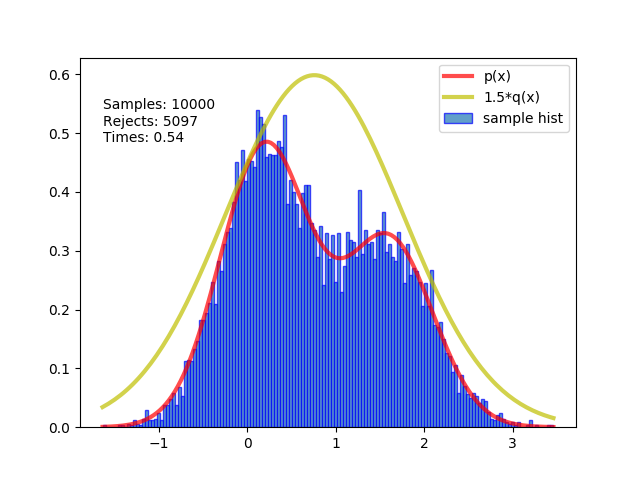

# CH19 马尔可夫链蒙特卡罗法

[TOC]

## 前言

### 章节目录

1. 蒙特卡罗法
   1. 随机抽样
   1. 数学期望估计
   1. 积分计算
1. 马尔可夫链
   1. 基本定义
   1. 离散状态马尔可夫链
   1. 连续状态马尔可夫链
   1. 马尔可夫链性质
1. 马尔可夫链蒙特卡罗法
   1. 基本思想
   1. 基本步骤
   1. 马尔可夫链蒙特卡罗法与统计学习
   1. Metropolis-Hastings算法
      1. 基本原理
      1. Metropolis-Hastings算法
      1. 单分量Metropolis-Hastings算法
   1. 吉布斯抽样
      1. 基本原理
      1. 吉布斯抽样算法
      1. 抽样计算

### 导读

- 这章有很多定义，其实看到马尔可夫的时候，马上想到之前HMM的时候学过。但是仔细一看，这章又多了蒙特卡罗。
- 蒙特卡罗法要解决的问题是，假设**概率分布**的定义已知，通过**抽样**获得概率分布的**随机样本**，并通过得到的随机样本对概率分布的特征进行分析。
- 蒙特卡罗法是一种**近似数值计算**的方法。
- MCMC是**以马尔可夫链为概率模型**的蒙特卡罗法。
- 一般的蒙特卡罗法中的抽样样本是独立的，而MCMC中的抽样样本不是独立的，样本序列形成马尔可夫链。
- 如何构建具体的马尔可夫链是这个方法的关键。
- 这一章表示随机变量序列用$X=\{X_0,X_1,\cdots,X_t\cdots\}$，具有马尔可夫性的随机序列称为马尔可夫链，所以后面用这个来表示马尔可夫链。在前面HMM部分，序列用$()$表示，而$\{\}$表示集合，这里注意下。
- 统计学和机器学习的**目的**是基于数据对概率分布的特征进行推断。
- 蒙特卡罗法要解决的**问题**是，**假设**概率分布的定义已知，通过**抽样**获得概率分布的随机样本，并通过得到的随机样本对概率分布的特征进行**分析**。
- 蒙特卡罗法的**核心**是随机抽样。

## 内容
### 基本定义
#### 马尔可夫链
### 蒙特卡罗法
#### 随机抽样
算法19.1 接受-拒绝算法
输入：抽样的目标概率分布的概率密度函数$p(x)$
输出：概率分布的随机样本$x_1,x_2,\cdots,x_n$
参数：样本数$n$

1. 选择概率密度函数为$q(x)$的概率分布，作为**建议分布**，使其对任一$x$满足$cq(x)\ge p(x)$，其中$c>0$。
1. 按照建议分布$q(x)$随机抽样得到样本$x^*$，再按照**均匀分布**在$(0,1)$范围内抽样得到$u$。
1. 如果$u\le \frac{p(x^*)}{cq(x^*)}$，则将$x^*$作为抽样结果；否则回到步骤(2)。
1. 直到拿到$n$个随机样本。

常见概率密度函数
1. 均匀分布
$p(x)=\frac{1}{b-a}$ anywhere within the interval [a, b), and zero elsewhere.
2. 正态分布
$p(x)=\frac{1}{\sqrt{2\pi\sigma^2}}e^{-\frac{(x-\mu)^2}{2\sigma^2}}$

综合图

算法19.1特点是容易实现，每一个采样过程，进行两次均匀采样，但是效率不高。样例程序10000个样本，拒绝掉一半，这个和$q(x)$以及$c$的选择有关。

#### 数学期望估计

#### 积分计算

### 马尔可夫链
### 马尔可夫链蒙特卡罗法
### Metropolis-Hastings算法
### Gibbs Sampling

## 参考

